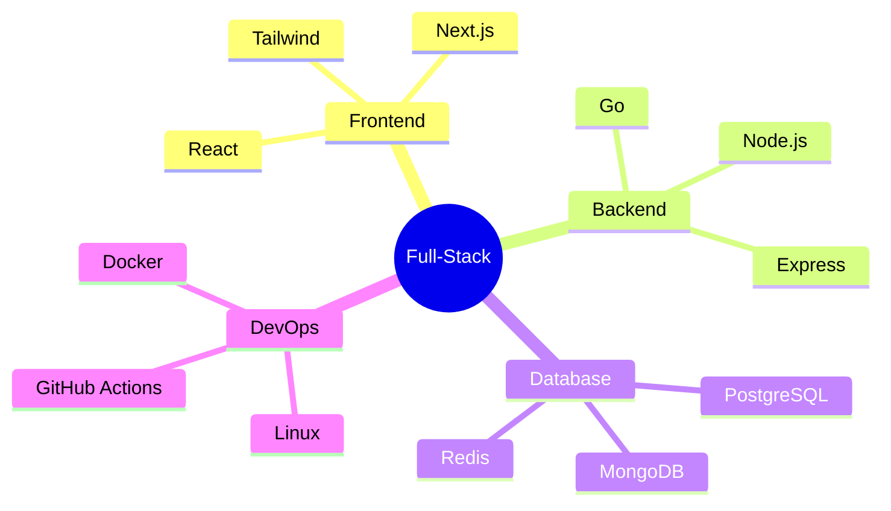

<h1 align="center">
  
</h1>

<p align="center">
  
</p>

<p align="center">
  I'm a <strong>Full-Stack Developer</strong>with who loves building end-to-end digital products — from database design to pixel-perfect UI.<br>
  I blend clean architecture with intuitive user experience to craft **modern, scalable web apps**.<br>
  Always learning, always improving 🚀
</p>

---

### 🧭 **About Me**
```yaml
name: "Birhan Kabtamu"
role: "Full-Stack Developer"
focus: ["Frontend + Backend Integration", "API Architecture", "Performance Optimization"]
stack: ["Go", "Node.js", "React", "Next.js", "PostgreSQL"]
currently_learning: "System Design & Microservices"
philosophy: "Write clean code, design scalable systems, and keep users happy."
```

---

🧩 **Tech Ecosystem**

### Frontend Development


### Backend Development


### Database & Storage


### DevOps & Tools


---

## ⚡ **Development Focus**

🧱 Building full-stack apps with **React**, **Next.js**, **Vue.js**, **Tailwind CSS** + **Go**, **Node.js**, **PHP** backend

🔗 Designing **RESTful APIs**, **GraphQL APIs** and efficient data models

⚙️ Writing reusable UI components & hooks

🚦 Setting up CI/CD pipelines for automated testing and deployment

🧠 Exploring microservices, caching, and load optimization

### **My Tech Mindmap**


---

## 📊 **GitHub Statistics**

<div align="center">

<!-- GitHub Stats -->


<!-- GitHub Streak -->


<!-- Most Used Languages -->


<!-- GitHub Trophies -->


</div>

---

---

## 💻 **Code Snapshots**

### Backend: Go REST API example
```go
// Backend: Go REST API example
r := gin.Default()
r.GET("/api/health", func(c *gin.Context) {
    c.JSON(200, gin.H{"status": "OK", "service": "API is running 🚀"})
})
r.Run(":8080")
```

### Frontend: Reusable React Hook
```javascript
import { useEffect, useState } from 'react';

export function useFetch(url) {
  const [data, setData] = useState(null);
  useEffect(() => {
    fetch(url).then(res => res.json()).then(setData);
  }, [url]);
  return data;
}
```

---

## 🏆 **Achievements**

🚀 Built and deployed multiple full-stack applications

🧩 Implemented caching layers that improved response time by 40%

🧱 Created modular Go APIs and integrated them with React frontends

🤝 Collaborated on projects with cross-functional teams and clients

---

## 📈 **Activity Graph**


---

## 🎯 **Current Focus**

- 🔥 **Building scalable web applications** with modern frameworks
- 🚀 **Optimizing performance** and user experience
- 📚 **Learning advanced patterns** in React and Node.js
- 🌟 **Contributing to open source** projects

---

## 📫 **Connect With Me**

<p align="center"> 
  <a href="mailto:berahan.kabtamu@gmail.com"></a> 
  <a href="https://t.me/berahan_dev"></a> 
  <a href="https://linkedin.com/in/berahan-kabtamu"></a> 
  <a href="https://github.com/berahankabtamu"></a> 
</p>

---

## ☕ **Fun Bits**

🎮 I treat problem-solving like gaming — strategy first

💡 I enjoy turning wireframes into living products

🧠 Logic puzzles and clean code fuel my mornings

🌍 Dreaming of building scalable apps that impact millions

<p align="center"> 
   
</p>
